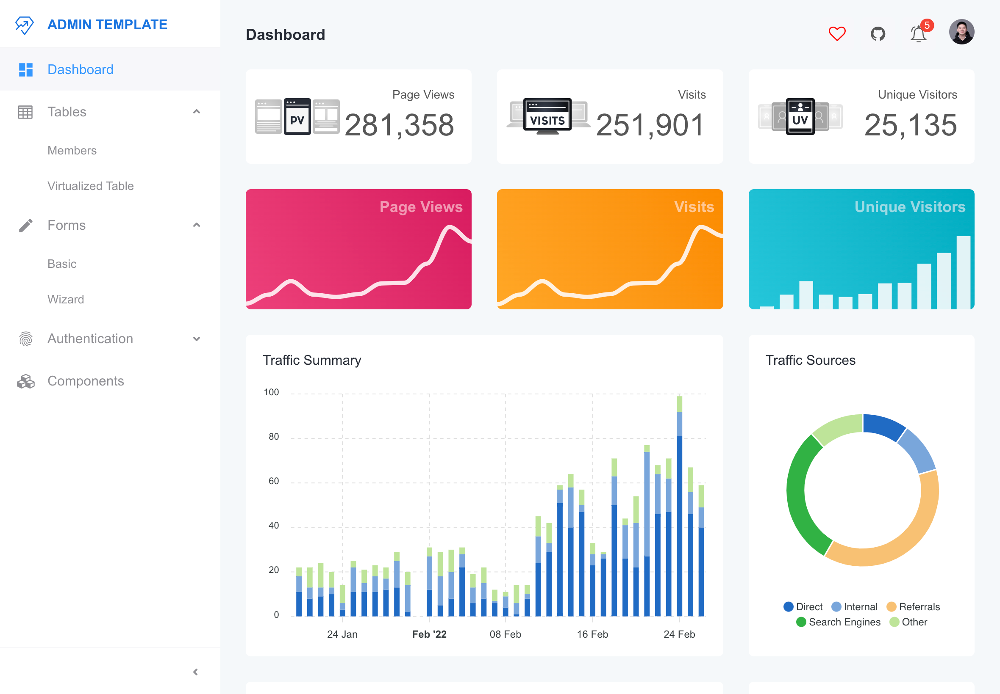
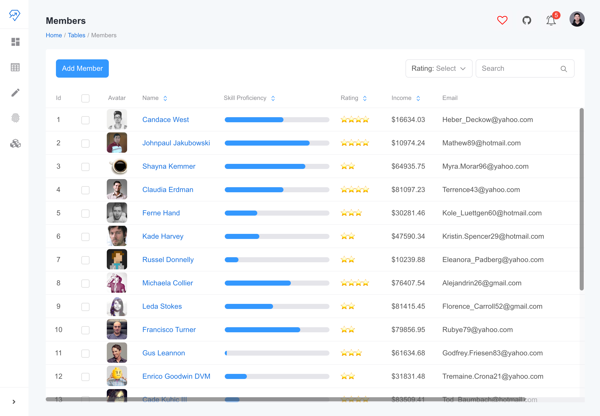

# Admin Dashboard Template

Ease developers’ life with the React Suite 5. TypeScript will help with optimizing. Quick start & easily extensible code.





## Development

Fork this repo to your namespace and clone to your local machine.

Install dependencies

```
npm install
```

Now you can start the development server by running npm run dev

It's serving at http://127.0.0.1:3100/ by default.

```
npm run dev
```

## License

MIT © [std-1224](https://github.com/std-1224)
